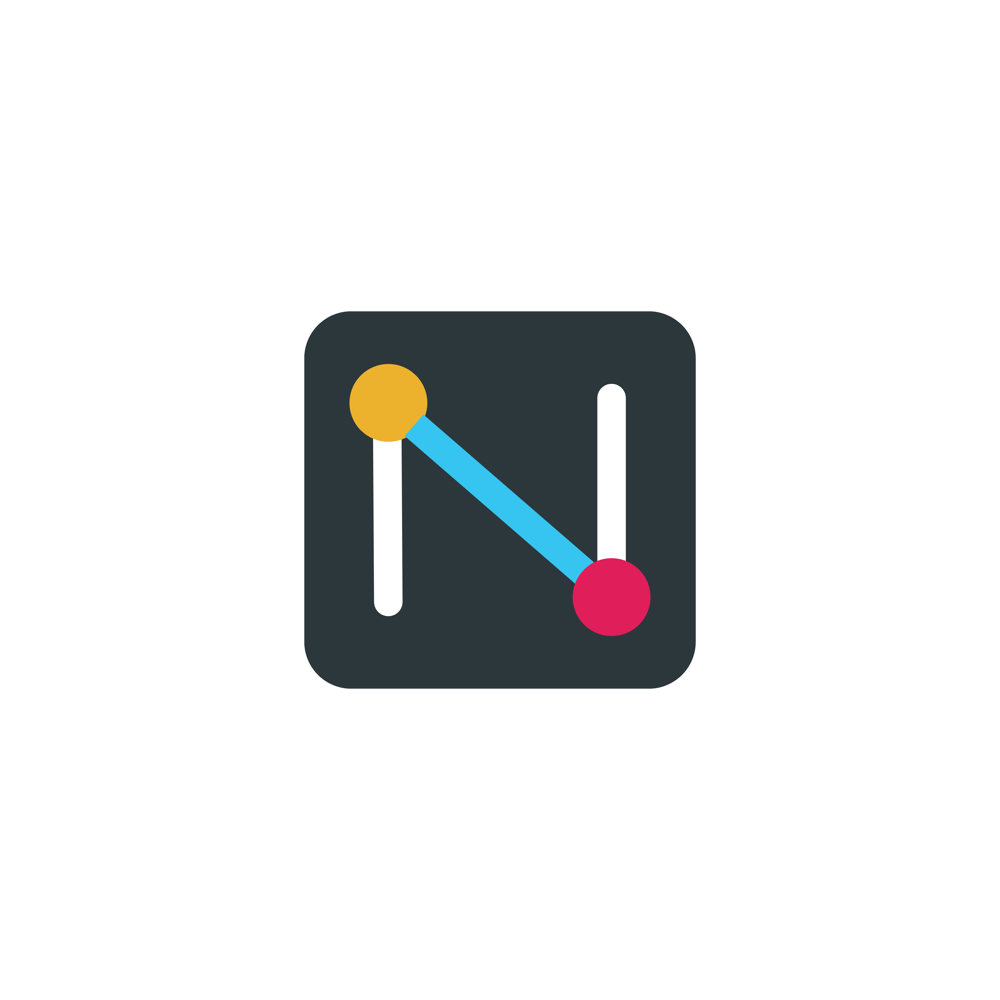
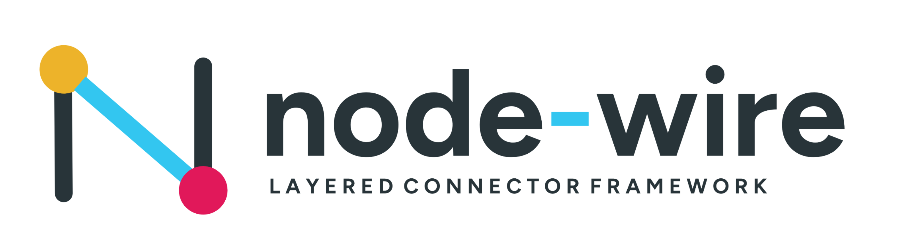

<!--
SPDX-FileCopyrightText: 2026 AOT Technologies

SPDX-License-Identifier: Apache-2.0
-->

# node wire

[](https://github.com/AOT-Technologies/node-wire/actions/workflows/pytest.yml)
[](https://github.com/AOT-Technologies/node-wire/actions/workflows/codeql.yml)
[](https://pypi.org/project/node-wire-runtime/)
[](https://github.com/AOT-Technologies/node-wire/releases/latest)
[](LICENSE)
<p align="center">
  
</p>
node wire is a three-layer Python platform that runs connector adapters (Google Drive, SMTP, Stripe, FHIR, Salesforce, Slack, and more) and exposes them over REST, gRPC, or MCP. It provides a consistent execution contract with built-in validation, resilience, and telemetry.

## Quick start

You need Python 3.13+ and [`uv`](https://docs.astral.sh/uv/). See [Installation](docs/installation.md) for everything else, including Windows commands.

```bash
git clone https://github.com/AOT-Technologies/node-wire.git
cd node-wire
uv sync --frozen --extra agents --dev
cp sample.env .env                  # set NW_ALLOWED_CONNECTORS, e.g. http_generic
export NW_REST_AUTH_DISABLED=true   # local dev only — otherwise /connectors/* and /ready return 503 until auth is configured
MODE=API uv run node-wire
```

Open [http://localhost:8000/docs](http://localhost:8000/docs) for the Swagger UI, or the [playground](http://localhost:8000/playground/) for interactive connector demos.

## Documentation

The full documentation is published at **[aot-technologies.github.io/node-wire](https://aot-technologies.github.io/node-wire/)** and lives in [`docs/`](docs/). Start with:

| I want to… | Read |
|---|---|
| Install, configure, run multi-tenant | [Installation](docs/installation.md) · [Configuration](docs/configuration.md) · [Tenancy](docs/architecture/tenancy.md) |
| Call a shipped connector | [Use a connector](docs/connectors.md) · [Connector catalog](docs/connector-reference.md#connector-catalog) |
| Build or generate a connector | [Build a connector](docs/connectors-build.md) · [CLI](docs/cli/index.md) |
| Deploy connectors as MCP servers | [MCP overview](docs/mcp.md) |
| Build wheels, MCP images, or run `docker-compose.mcp.yml` | [Packaging](docs/packaging.md) · [Local wheels → images](docs/local-packages-to-images.md) |
| Understand the codebase, in order | [Reading map](docs/reading.md) |

## Contributing

Contributions are welcome! Please read [CONTRIBUTING.md](CONTRIBUTING.md) for
the development setup, quality checks, and PR conventions, and our
[Code of Conduct](CODE_OF_CONDUCT.md).

## Security

To report a vulnerability, please follow our [Security Policy](SECURITY.md). Do
not open a public issue for security reports.

---

## License

This project is licensed under the Apache License 2.0.
See the LICENSE file for details.
