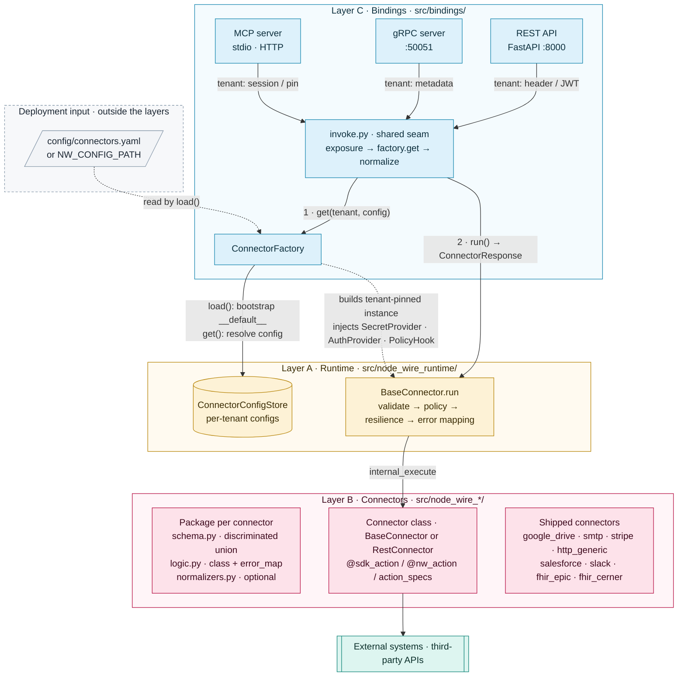
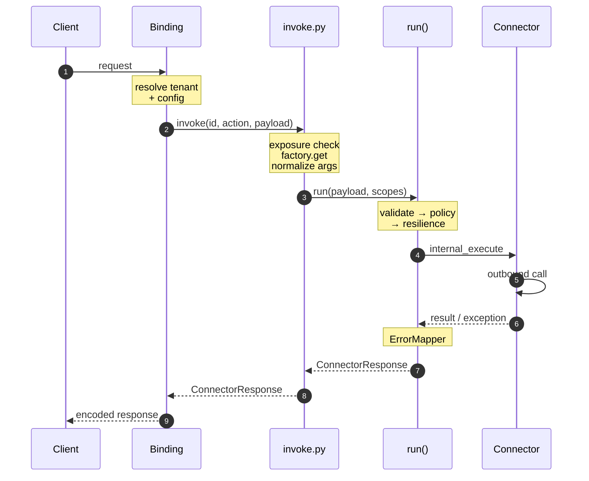
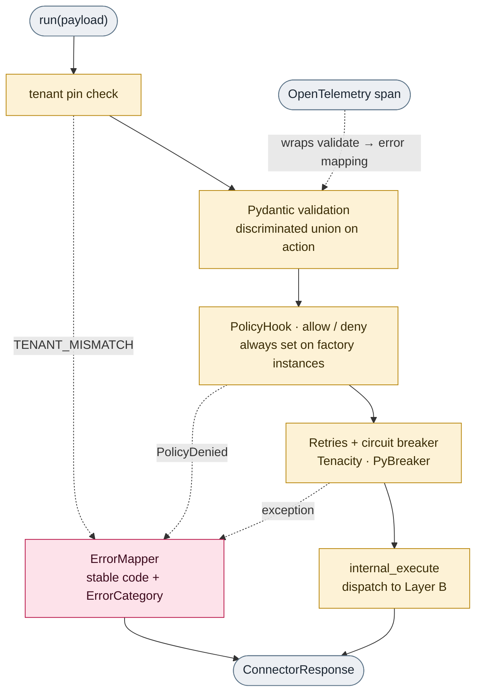

<!--
SPDX-FileCopyrightText: 2026 AOT Technologies

SPDX-License-Identifier: Apache-2.0
-->

# Node Wire Architecture

The Node Wire platform is designed as a three-layer Python platform that runs connector adapters over REST, gRPC, or MCP. Each connector talks to an external system (e.g., Google Drive, SMTP, Stripe); the runtime provides a consistent execution contract, error handling, and resilience.

## High-Level Architecture

The platform is split into three layers:

- **Layer A – Runtime** (`src/node_wire_runtime/`): The engine that every connector runs inside. It defines the execution contract, a standard error taxonomy, retries and circuit breaking, and telemetry.
- **Layer B – Connectors** (`src/node_wire_<connector>/`): Adapters that implement that contract and call external systems (HTTP Generic, SMTP, Stripe, Google Drive, FHIR Epic, FHIR Cerner, Salesforce, Slack). Each connector has its own input/output schema and business logic.
- **Layer C – Bindings** (`src/bindings/`): How the platform is exposed to the outside world—REST API, gRPC server, MCP server—and `ConnectorFactory`, which builds tenant-pinned connector instances. The factory reads `config/connectors.yaml` at startup (an external input, not part of the layer) and bootstraps it into the runtime `ConnectorConfigStore` (Layer A).

External callers reach the platform over REST, gRPC, or MCP. Each binding adapter resolves
transport-specific tenant and caller identity, then hands off to the shared invoke seam.

### Request lifecycle

A failure anywhere in `run` is mapped by `ErrorMapper` into the same `ConnectorResponse`
envelope with an `ErrorCategory` — bindings translate that to an HTTP status, a gRPC code,
or an MCP tool error, but the connector contract is identical on all three.

---

## Layer A – `runtime`

**Purpose:** Provide shared execution and reliability so every connector behaves in a consistent way (validation, errors, retries, telemetry) without each connector reimplementing the same plumbing.

**Location:** `src/node_wire_runtime/`

### Main Components

- **BaseConnector**: Abstract base class for all connectors. It handles the `run()` method pipeline.
- **ConnectorResponse / ErrorCategory**: Unified response shape and error categorization (`RETRYABLE`, `BUSINESS`, `AUTH`, `FATAL`).
- **ErrorMapper**: Maps exception types to stable error codes and categories.
- **Resilience**: Decorators for retries (Tenacity) and circuit breaking (PyBreaker).
- **SecretProvider**: Abstraction for fetching secrets (API keys, credentials).
- **PolicyHook**: Allow/deny check before execution, based on principal, scopes, or tenant. The hook type is pluggable. `BaseConnector` accepts `policy_hook=None`, but `ConnectorFactory` always attaches one: `ScopePolicyHook` when an MCP scope map or `NW_MCP_SCOPE_POLICY_DEFAULT=deny` is configured, otherwise `TenantConfigHook` (a tenant must have a config for the connector).
- **Tenant pinning**: Factory-built instances carry `_tenant_id`; `run()` uses that pin when `tenant_id` is omitted and rejects mismatched caller ids with `TENANT_MISMATCH`.
- **Telemetry**: OpenTelemetry integration for tracing.

### The `run()` pipeline

Every action goes through the same sequence. The tenant pin is checked before the
trace span opens; everything after it runs inside the span.

---

## Layer B – `connectors`

**Purpose:** System adapters that talk to external services. Each connector defines input/output models and declares its actions with `@sdk_action` (or its alias `@nw_action`) or `action_specs`. Connectors do not implement `internal_execute` — `BaseConnector.internal_execute` dispatches to the declared action. Hand-written connectors subclass `BaseConnector`; OpenAPI-generated ones subclass `RestConnector`. `ConnectorFactory` injects the tenant-scoped `SecretProvider`, `AuthProvider`(s), and `PolicyHook` when it builds an instance.

**Location:** `src/node_wire_<name>/`

### Common Structure

- `schema.py`: Pydantic models for request and response.
- `logic.py`: Connector class and external service logic, including an optional `error_map` class attribute that registers the connector's exception mappings — scoped to that connector's own `connector_id` so they can never be resolved for another connector's errors.
- `normalizers.py` (optional): MCP argument normalizers that map LLM aliases to canonical fields before `run()` (wired via `mcp_normalize` on the action).

---

## Layer C – `bindings`

**Purpose:** Expose connectors over different protocols and build tenant-pinned connector instances from configuration (read from `config/connectors.yaml`, held in the runtime config store).

**Location:** `src/bindings/`

### Binding invoke

REST, MCP, and gRPC share one invoke seam in `src/bindings/invoke.py`. Each binding adapter resolves transport-specific tenant and caller identity, then delegates exposure, factory resolution, ingress normalization, and `run()` to that module. Transport-only concerns (HTTP status mapping, MCP pagination guardrails, protobuf encoding) stay in the respective binding.

### Bindings Offered

- **REST API (FastAPI)**: Dynamic routes at `POST /connectors/{connector_id}/{action}`.
- **gRPC Server**: Protocol buffers based interface on port 50051.
- **MCP Server**: Model Context Protocol implementation for AI agents.
