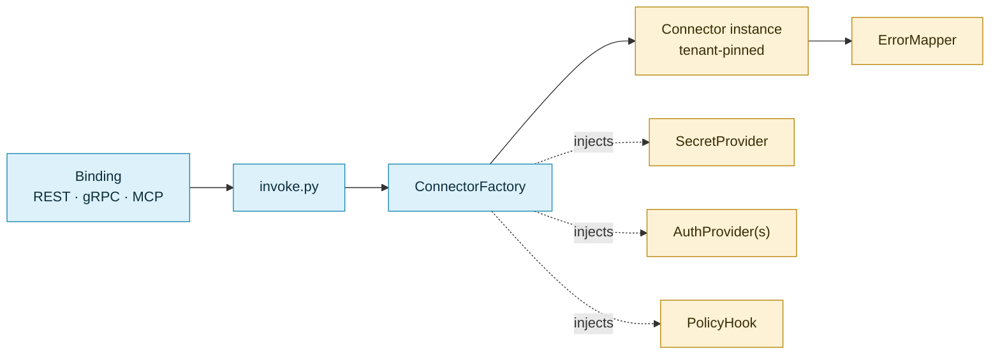

<!--
SPDX-FileCopyrightText: 2026 AOT Technologies

SPDX-License-Identifier: Apache-2.0
-->

# Seams

The interfaces where one layer hands off to another, and where a host can plug in its own
implementation. Read the [overview](../architecture.md) and the [domain](domain.md) first. Read
the [`run()` pipeline](../architecture.md#the-run-pipeline) next.

## `ConnectorFactory`

`src/bindings/factory.py`. It builds tenant-pinned connector instances.

- `load()` reads `config/connectors.yaml` (or `NW_CONFIG_PATH`) and bootstraps it into the config
  store as the `__default__` tenant. It does not instantiate connectors.
- `await get(connector_id, tenant_id=…, config_name=…)` resolves the tenant's config and injects
  the tenant-scoped `SecretProvider`, the `AuthProvider`(s) and the `PolicyHook`. The instance is
  cached per `(tenant, connector, config)`, and a store write drops the cached entry.
- `ConnectorFactory(auth_provider_hook=…)` lets a layer supply its own auth provider before the
  built-in ones. `node-wire-toolhive` uses it for the credential relay.
- Connectors come from the registry filled by `auto_register()`. The factory has no per-connector
  branches.

Method-by-method reference: [Connector reference — `ConnectorFactory` API](../connector-reference.md#connectorfactory-api).

## `invoke.py`

`src/bindings/invoke.py`, the one path every binding uses to run an action. The binding resolves
the tenant, the named config and the caller identity first. `invoke()` then:

1. checks `exposed_via` for the protocol (`ConnectorNotExposed` otherwise);
2. calls `factory.get(...)`;
3. runs the action's normalizers and enforces that the action named by the route or tool wins over
   any `action` in the payload;
4. calls `run(payload, principal=…, tenant_id=…, scopes=…)`.

Only transport concerns stay in each binding: HTTP status mapping, MCP pagination and protobuf
encoding. See [Connectors on REST, MCP and gRPC](../connector-bindings.md).

## `PolicyHook`

`node_wire_runtime.policy.PolicyHook`, an allow/deny check inside `run()` before the action executes.
It raises `PolicyDenied`, which maps to `POLICY_DENIED`. The factory always attaches one:

| Condition | Hook |
|---|---|
| `NW_MCP_ACTION_SCOPE_MAP_JSON` set, or `NW_MCP_SCOPE_POLICY_DEFAULT=deny` (the default) | `ScopePolicyHook`: the caller needs `mcp:<connector>.<action>` or the mapped scope |
| Otherwise (`allow` with an empty map) | `TenantConfigHook`: the tenant must have a config for the connector |

`NW_MCP_SCOPE_POLICY_STRICT=true` refuses to start in the second case. The hook applies to every
`run()`, in-process calls included. Variables: [Configuration](../configuration.md#transport-binding-config).

## `SecretProvider`

`node_wire_runtime.secrets.base.SecretProvider`. Connectors read credentials only through
`self.secret_provider.get_secret(key)`. A missing key raises `SecretNotFoundError` (fail-closed).

- The factory picks the backend from `NW_SECRET_BACKEND` (`env`, or `aws_env` for AWS Secrets
  Manager with env fallback).
- For a named tenant it wraps that backend in `TenantSecretProvider`, which scopes the key to
  `NW_{TENANT}_{CONNECTOR}_{KEY}` and reads the `tenants.yaml` overlay before the backend
  ([Tenancy](tenancy.md#tenant-secrets)).

Backend variables: [Configuration — Secrets Management](../configuration.md#secrets-management).

## `AuthProvider`

`node_wire_runtime.auth.base.AuthProvider`. It turns secrets into request credentials: headers, a
query parameter, or a vendor client. The connector's `auth:` block in `connectors.yaml` selects the
provider, and `auth_schemes:` adds named extras. Connectors call `await self.get_auth_headers()`.
Provider types and fields: [Build a connector — Authentication](../connectors-build.md#authentication).

## `ErrorMapper`

`node_wire_runtime.errors.ErrorMapper`. It maps an exception to `(ErrorCategory, error_code)` by walking
the exception's MRO for the closest match, within the raising connector's own `error_map` only.
Runtime-owned exceptions (`PolicyDenied`, `TenantMismatchError`) are registered globally. Writing
an `error_map`: [Build a connector](../connectors-build.md#optional-error_map-for-errormapper).
