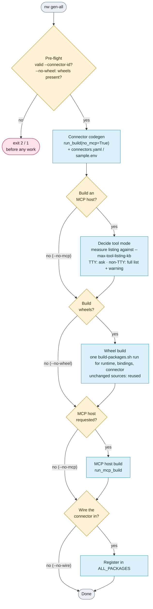

<!--
SPDX-FileCopyrightText: 2026 AOT Technologies

SPDX-License-Identifier: Apache-2.0
-->

# nw CLI

`nw` is the unified CLI for turning an OpenAPI spec into a connector, wheels, an MCP host, and a Docker image. `gen-all` runs connector → wheel → MCP host → wire; the image is a separate `docker-build` step. It orchestrates [`nw-connector-builder`](nw-connector-builder.md), [`scripts/build-packages.sh`](../packaging.md), and [`nw-mcp-builder`](nw-mcp-builder.md) without replacing those tools.

ToolHive deploy/verify (`thv`) is **out of scope** — `nw` stops at `docker-build`. To run the image and check it lists its tools, see [nw-mcp-builder: Docker](nw-mcp-builder.md#docker). For manual ToolHive registration and the end-to-end agent path, see [nw-mcp-builder](nw-mcp-builder.md#platform-and-toolhive-read-this-first) and [toolhive_agent_scenario.md](../toolhive_agent_scenario.md).

---

## Install

`nw-cli` is part of the monorepo **dev** dependency group, so the dev install from [Installation](../installation.md#3-install-dependencies) provides it. Then, from the **node-wire** repo root (hard assumption — there is no `--node-wire-root` flag):

```bash
uv run nw --help
uv run nw --version   # or -V
```

Global options go before the command (`uv run nw -v gen-all ...`):

| Option | Effect |
|--------|--------|
| `--verbose` / `-v` | Stream build tool output (codegen report, `build-packages.sh`, `docker build`) line by line. Always on without a terminal, e.g. in CI |
| `--debug` | Print the full traceback with an error (or set `NW_DEBUG=1`) |

---

## Commands

| Command | What it does |
|---------|----------------|
| `nw gen-all` | One-shot: connector codegen → Linux wheels → MCP host → wire |
| `nw gen-whl` | Standalone wheel build via `scripts/build-packages.sh` |
| `nw gen-mcp` | Standalone MCP host (requires existing wheels) |
| `nw docker-build` | `docker build` inside `nw-mcp-builder/out/<server>-mcp/` |
| `nw gen-stacklok` | Scope an OpenAPI spec with stacklok's `/ai-scoping`, then build a stacklok MCP server on the node-wire runtime |

### `nw gen-all`

```bash
uv run nw gen-all \
  --connector-id pet_store \
  --path path/to/openapi.yaml
```

**Trial run, or keeping the connector?** By default `gen-all` wires the connector into `config/connectors.yaml`, `sample.env` and `scripts/build-packages.sh`. From then on `tests/test_docs_lifecycle.py` fails until the connector has a [Package inventory](../packaging.md#package-inventory) row (see [When wire is enabled](#when-wire-is-enabled)).

- **Keeping it:** add the inventory row.
- **Trial that stops before the MCP host:** add `--no-wire --no-mcp`. You get the connector and wheels, and nothing is registered.
- **Trial through `docker-build`:** keep wiring on. The MCP host is built from the connector's `config/connectors.yaml` entry, so `--no-wire` without `--no-mcp` fails at the MCP stage with `<id> is not in config/connectors.yaml; wire it in first`. When you are done, follow [Removing a throwaway connector](#removing-a-throwaway-connector).

| Flag | Effect |
|------|--------|
| `--connector-id` | Connector id (required) |
| `--path` | OpenAPI/Swagger file or URL (required) |
| `--no-wheel` | Skip wheel build; the MCP host bundles the wheels already in `dist/` (checked before codegen starts) |
| `--no-mcp` | Skip MCP host build |
| `--no-wire` | Skip `connectors.yaml` / `sample.env` / `ALL_PACKAGES` registration. The MCP stage needs the `connectors.yaml` entry, so combine with `--no-mcp` unless the connector is already wired |
| `--force` | Overwrite existing connector / MCP output |
| `--rebuild-wheels` | Rebuild every wheel, even those whose sources are unchanged |
| `--tool-search` | MCP host serves tools through `nw_search_tools` + `nw_call_tool` (no prompt) |
| `--full-tool-list` | MCP host lists every tool, even over budget (no prompt, no warning) |
| `--max-tool-listing-kb` | Tool listing budget in KB (default `25`) |

Checks that need no work run first: the connector id must be a lowercase Python identifier, and with `--no-wheel` the wheels the MCP host bundles must already exist. Then the stages run in-process and in order, each skippable independently:



Stages are **in-process** function calls (never re-invokes `nw`). Connector codegen always passes `no_mcp=True` to `run_build` so the builder’s host-only MCP hand-off is skipped; MCP uses `skip_build_wheels=True` against wheels from `build-packages.sh`.

#### When wire is enabled

- `run_build(..., wire=True)` updates `config/connectors.yaml` and `sample.env`
- `nw` inserts `packages/connectors/<id>` into `scripts/build-packages.sh`’s `ALL_PACKAGES` list if missing
- Keeping the connector? Add its row to the [Package inventory](../packaging.md#package-inventory) in `docs/packaging.md`. The first cell is the `project.name` from its `pyproject.toml` in backticks, e.g. `` | `node-wire-<id-dashed>` | `src/node_wire_<id>/` | `<id>` | `` (`<id-dashed>` is defined below). `tests/test_docs_lifecycle.py` fails until that table's names match `ALL_PACKAGES` exactly. For a throwaway connector, revert the three wire edits listed below once you are done (or pass `--no-wire --no-mcp` up front if you don't need the MCP host). Undo only what `gen-all` changed (`git diff config/connectors.yaml sample.env scripts/build-packages.sh` shows it): delete the added `<id>:` block, the `ALL_PACKAGES` line and the `<ID>_*` secret lines with their comment, and remove `,<id>` from the existing `NW_ALLOWED_CONNECTORS` line. Don't `git checkout` the whole file, which also discards any other uncommitted edits in it.

**Where the outputs land.** After a successful run (exit `0`, every stage ✓ in the summary panel), check these paths. `<id-dashed>` is the connector id with `_` replaced by `-` (`pet_store` → `pet-store`).

| Output | Path |
|--------|------|
| Connector source | `src/node_wire_<id>/` (`logic.py`, `schema.py`, `README.md`) |
| Connector package | `packages/connectors/<id>/` (`pyproject.toml`, `setup.py`, `tests/`, `report.json`) |
| Wheels | `packages/connectors/<id>/dist/node_wire_<id>-*.whl`, plus `packages/runtime/dist/` and `packages/bindings/dist/` (Linux by default) |
| MCP scope fixture | `nw-mcp-builder/fixtures/<id>_nw.yaml` |
| MCP host | `nw-mcp-builder/out/<id-dashed>-nw-mcp/` (layout: [nw-mcp-builder: Generated project layout](nw-mcp-builder.md#generated-project-layout)) |
| Wire edits | `config/connectors.yaml` (new `<id>:` entry), `sample.env` (id added to `NW_ALLOWED_CONNECTORS`, plus the connector's secret names), `scripts/build-packages.sh` (`ALL_PACKAGES` line) |

`--no-wheel`, `--no-mcp` and `--no-wire` skip the matching rows.

#### Removing a throwaway connector

Revert the wire edits as above, then delete the generated paths: `src/node_wire_<id>/` (and `src/node_wire_<id>.egg-info/` if present), `packages/connectors/<id>/`, `nw-mcp-builder/fixtures/<id>_nw.yaml` and `nw-mcp-builder/out/<id-dashed>-nw-mcp/`. Leave `packages/runtime/dist/` and `packages/bindings/dist/` alone; other connectors reuse those wheels. If you ran `nw docker-build`, also remove the image: `docker rmi <id-dashed>-nw-mcp:latest`.

**Wheel reuse.** Each wheel build stamps the package's `dist/` with a hash of its sources (`.nw-source-<mode>.sha256`). The next `gen-all` rebuilds only the packages whose sources changed or whose stamped wheels are gone, all in one `build-packages.sh` run; `--rebuild-wheels` rebuilds everything. Linux wheel builds need Docker: `nw` checks that the daemon answers before starting one, and fails with the reason if it does not.

**Tool mode.** Right after codegen (before the wheel builds), the connector's MCP tool listing is measured. Over the budget (`--max-tool-listing-kb`, default 25 KB) the progress bars pause and you are asked how the MCP host should expose its tools — the full tool list, or tool search (`nw_search_tools` + `nw_call_tool`, schemas on demand) — with an explanation of where tool search can fail. Without a terminal the full list is generated and a warning names the flags. `--tool-search` / `--full-tool-list` decide up front. The build never fails on size; the choice becomes the host's default `NW_MCP_TOOL_MODE`. Wording and logic live in nw-mcp-builder (`nw_mcp_builder/tool_listing.py`); see its README.

### `nw gen-whl`

```bash
uv run nw gen-whl --connector-id pet_store          # Linux-only (default)
uv run nw gen-whl --connector-id pet_store --host   # host-only
uv run nw gen-whl --connector-id pet_store --all    # cibuildwheel matrix
uv run nw gen-whl --runtime                         # packages/runtime only
```

Default mode passes **`--linux-only`** to `scripts/build-packages.sh` (not the script’s host+Linux combined default). The CLI does not expose a `--linux-only` flag — omit `--host` / `--all` to get that mode. `--host` and `--all` are mutually exclusive. Runtime is not rebuilt with every connector build — use `--runtime` when needed. `--connector-id` is required unless `--runtime` and/or `--bindings` is set. Flags combine into one build run (`--runtime --bindings --connector-id pet_store` builds all three). `gen-whl` always builds; it also writes the source stamps `gen-all` reuses. `--bindings` builds `packages/bindings` (the MCP host surface) — `gen-mcp` asks you to run `nw gen-whl --bindings` when that wheel is missing.

### `nw gen-mcp`

```bash
uv run nw gen-mcp --connector-id pet_store
uv run nw gen-mcp --connector-id pet_store --force-output
uv run nw gen-mcp --connector-id pet_store --tool-search
```

Takes the same `--tool-search` / `--full-tool-list` / `--max-tool-listing-kb` flags as `gen-all`, and asks the same question before building the host.

Always `skip_build_wheels=True`. If any of the runtime, bindings or connector wheels is missing:

- **Interactive (TTY):** one prompt names every missing wheel and builds them in one run
- **Non-interactive:** exits non-zero with the exact fix command (e.g. `nw gen-whl --runtime --bindings`)

There is no `--yes` / auto-confirm flag.

### `nw docker-build`

```bash
uv run nw docker-build --connector-id pet_store
uv run nw docker-build --connector-id pet_store --tag v1
uv run nw docker-build --project nw-stacklok-builder/out/petstore-mcp   # a gen-stacklok server
```

`--connector-id` finds the projects generated for that connector: the `gen-all` / `gen-mcp` host (`nw-mcp-builder/out/<id-dashed>-nw-mcp/`, image `<id-dashed>-nw-mcp:<tag>`, with `_` in the id replaced by `-`) and any `gen-stacklok` server in `nw-stacklok-builder/out/` whose `config/connectors.yaml` lists it (image named after its folder, e.g. `petstore-mcp:<tag>`). With several, a terminal gets an arrow-key menu (newest first); without one the newest is built, with a warning naming it. `--project <dir>` builds a project by path instead, for one written outside those folders (`gen-stacklok --output-dir`).

Builds `docker build -t <hyphenated-id>-nw-mcp:<tag> .` inside `nw-mcp-builder/out/<hyphenated-id>-nw-mcp/` (e.g. `pet_store` → image `pet-store-nw-mcp:latest`, project dir `…/out/pet-store-nw-mcp/`). `--tag` defaults to `latest`. Pass secrets at **run** time (`docker run --env-file` / `-e`); they are not baked into the image. To run the image and verify it, follow [nw-mcp-builder: Docker](nw-mcp-builder.md#docker) — the container needs `NW_MCP_HOST=0.0.0.0` to be reachable.

If the MCP project directory is missing, one TTY / non-TTY prompt offers to generate it first (with any missing wheels), then builds the image; without a terminal it exits with `nw gen-mcp --connector-id <id>` as the fix. Docker must be running: `nw` checks before building.

### `nw gen-stacklok`

```bash
uv run nw gen-stacklok --path <spec path or URL> --connector-id pet_store \
  [--workflow "..." ...] [--auth-hint "..."] [--scoping-notes "..."]
uv run nw gen-stacklok --scope mcp-scope.yaml --connector-id pet_store      # reviewed scope → Phase 3
uv run nw gen-stacklok --scope mcp-scope.yaml --force --no-wheel --no-lock --output-dir out/
```

With `--path` it runs stacklok's Phases 1–3 in one go:
1. prepares the spec;
2. opens Claude Code with the `/ai-scoping` skill, which asks its questions and stops at its
   approval gates as in stacklok's flow. `--workflow`, `--auth-hint` and `--scoping-notes` are
   starting answers. Exit the session to continue. `--headless`, or no terminal, runs it
   unattended with `claude -p`;
3. **pauses for the human review** with a short summary: server, tool count and names, auth,
   stacklok's validation result, how many points the AI flagged in `scoping-summary.md`, and the
   project it will write (and whether that replaces an existing one). Pick the next step with the
   arrow keys and Enter (or an option's first letter):
   - **Generate the MCP server** (only offered when the scope passes validation),
   - **Show details**: the tools with their endpoints, and every flagged point,
   - **Edit the scope** (in `$VISUAL` / `$EDITOR`, or your own editor), then review it again,
   - **Redo the AI scoping**, with feedback passed to the AI (the previous scope is kept if the
     rerun fails),
   - **Stop here**, printing the `--scope` command to resume with.

   With output piped the menu takes a typed letter instead; with no terminal at all it stops here;
4. generates.

A second `--path` run reuses the scope in `nw-stacklok-builder/scoping/<id>/` (the review says so,
with its date; `r` or `--rescope` redoes it). The connector is always rebuilt from the spec. With
`--scope`, the scope is validated before anything is built, and you're asked whether to replace an
existing output project; `--force` replaces it without asking.

Builds a [stacklok mcp-builder](https://github.com/stacklok/mcp-builder) server on the node-wire
runtime from a stacklok `mcp-scope.yaml`: connector codegen from the scope's `spec.source` →
wheels for the image (cp313 musllinux for stacklok's Alpine base, via `scripts/build-packages.sh
--cibw-linux` in Docker; unchanged packages are reused) → the vendored stacklok
generator (`nw-stacklok-builder/out/<server>-mcp/`, then `uv lock`). `--connector-id` may be
omitted when the scope has a `runtime: {type: node_wire, connector_id: ...}` block. See
[stacklok MCP servers](../stacklok-mcp-servers.md).

---

## Output

Every command shows the same brand-colored `rich.progress` display (amber spinner, blue bar, pink on failure), then a bordered summary panel: each stage with ✓ / ✗ / – (skipped) and its duration, and the results (connector, MCP host, image). Commands to run next are printed below the panel so they copy cleanly.

- **On a terminal:** build tool output is kept out of the way. The running stage shows its latest line under the bars; `nw`'s own messages (tool mode, reused wheels, operation counts) always print.
- **With `--verbose`, or without a terminal (CI):** build tool output streams line by line above the bars.
- **Every run** writes a full, timestamped log to `<tmp>/nw-logs/<command>-<time>.log`, printed as `Log:` under the panel.
- **On failure** the panel names the stage and the reason, the last 15 lines of that stage's output (when they were not streamed), and a fix hint. The error is reported once; there is no traceback unless you pass `--debug`. An unexpected internal error is labelled as such, with a pointer to `--debug`.

Ctrl-C stops the running build tool (no orphaned `docker` / `cibuildwheel` processes) and exits 130.

---

## Exit codes

| Code | Meaning |
|------|---------|
| `0` | Success |
| `1` | Stage failure, missing prerequisite (Docker, wheels; non-interactive or declined), root resolution error, or an unexpected internal error |
| `2` | Usage error: conflicting or missing flags (e.g. `--host` with `--all`), an invalid `--connector-id`, or a codegen refusal such as an existing connector without `--force` |
| `130` | Interrupted (Ctrl-C) |

---

## Relationship to sibling CLIs

| Tool | Role |
|------|------|
| `nw` | Orchestrator for the happy path |
| `nw-connector-builder` | Still available for low-level OpenAPI codegen |
| `nw-mcp-builder` | Still available for MCP-only generation |
| `nw-stacklok-builder` | Vendored stacklok generator driven by `nw gen-stacklok`. Ships stacklok's `mcp-builder` (analyze / validate / generate) and `mcp-builder-schema`, which the ai-scoping skill calls; you rarely run them yourself |

Deprecating the standalone builder entry points is **not** part of this CLI.

---

## Tests

```bash
uv run pytest tests/nw_cli -v --no-cov
```

Coverage is unit/mocked only (no live Docker or network spec fetch).

---

## Related docs

| Doc | When to read it |
|-----|-----------------|
| [nw-connector-builder.md](nw-connector-builder.md) | OpenAPI → connector codegen details |
| [nw-mcp-builder](nw-mcp-builder.md) | Generated MCP host layout, ToolHive, Inspector |
| [packaging.md](../packaging.md) | `build-packages.sh`, wheels, PyPI |
| [configuration.md](../configuration.md) | `connectors.yaml` and env vars |
