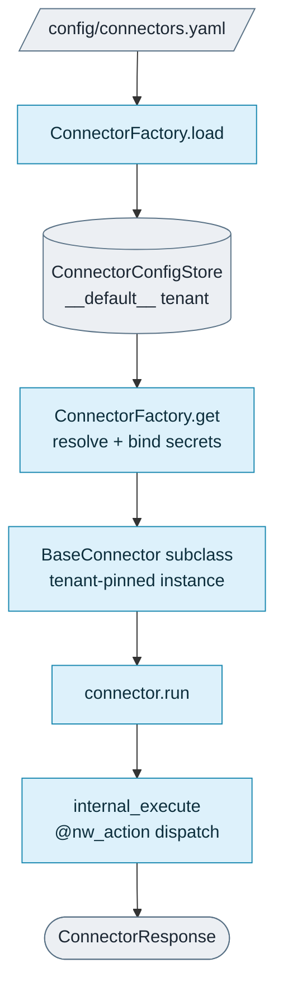

<!--
SPDX-FileCopyrightText: 2026 AOT Technologies

SPDX-License-Identifier: Apache-2.0
-->

# Build a connector (`src/node_wire_*`)

How connectors fit into Node Wire, how to write one by hand, and how to wire its credentials and ship it. Connector implementations live under `src/node_wire_<connector_id>/` (e.g. `src/node_wire_google_drive/`); the shared base class lives at **`src/node_wire_runtime/base_connector.py`**.

Only need to call a connector that already ships? Start at [Use a connector](connectors.md). Generating one from an OpenAPI spec instead? Use [`nw gen-all`](cli/nw-cli.md) — this page covers the hand-written path.

## On this page

| If you want to… | Go to |
|---|---|
| Understand the contract every connector implements | [How connectors work](#how-connectors-work) |
| Write a new connector by hand | [Write a connector step by step](#write-a-connector-step-by-step) |
| Copy a complete, minimal HTTP connector | [Minimal HTTP connector, end to end](#minimal-http-connector-end-to-end) |
| Wire up credentials | [Authentication](#authentication) |
| Ship it | [Operations](#operations) |

---

## How connectors work

A connector is a Layer B package; the layers are described in [Architecture](architecture.md), and the vocabulary in [Domain](architecture/domain.md).

### Package layout and registration

Each connector is a **top-level package** under `src/` (e.g. `node_wire_fhir_epic`):

| File | Role |
|------|------|
| `__init__.py` | Required empty file — marks the directory as a Python package. |
| `schema.py` | Pydantic input/output models. Each input model has an `action: Literal[...]` discriminator field (often combined into a discriminated union). |
| `logic.py` | Connector class: `BaseConnector` subclass — either explicit `@nw_action` methods, or **`action_specs`** plus an optional `_execute_action_spec` override for SDK dispatch. |
| `action_spec.py` (optional) | Declarative `SdkActionSpec` entries mapping validated models to vendor SDK calls (see Google Drive). |
| `exceptions.py` | Optional: custom exception types. |

At startup, call **`node_wire_runtime.connector_registry.auto_register()`**: it loads entry points in group `node_wire.connectors` and imports each connector's `logic` module, triggering `BaseConnector.__init_subclass__`. That both populates the registry returned by `get_connector_registry()` and registers the connector's `error_map` with `ErrorMapper` — scoped to that connector's own `connector_id`, so one connector's exception mappings can never be resolved for another connector's errors even when both are loaded in the same process. There is no separate registration step or module.

---

### The unified `BaseConnector`

There is one base class for all connectors: **`BaseConnector`** (`src/node_wire_runtime/base_connector.py`). It handles:

- Input validation via a Pydantic **discriminated union** (the `action` field selects the right model)
- Optional **policy hook** enforcement
- **Retries and circuit breaking** via `with_resilience`
- **Error mapping** via `ErrorMapper`
- OpenTelemetry **tracing**
- A standard **`ConnectorResponse`** envelope

Actions are declared either with the **`@nw_action("name")`** decorator on async methods, or by listing them in **`action_specs`** (the runtime generates equivalent handlers). A connector can have **one or many** actions — there is no separate "single-action" type.



---

## Write a connector step by step


The production **Google Drive** connector (`src/node_wire_google_drive/`) is a good template for wrapping a **vendor Python SDK** (here `googleapiclient` / Drive API v3): service-account auth in `build_client()`, a discriminated union of operations in `schema.py`, and **`action_specs`** so each API surface becomes a manifest action without duplicating boilerplate.

### Step 1 — Define your schemas (`schema.py`)

Each operation is a Pydantic model with an **`action`** field whose type is a `Literal["…"]` unique to that operation. You do **not** have to build the union yourself. When your class is defined, `BaseConnector` collects each action's input model and builds the discriminated union on `action` for you, wrapped in a `RootModel`. It finds that model from the `params` type hint of an `@nw_action` method, or from `input_model` on an `SdkActionSpec`. If the connector has only one action, the `RootModel` wraps that single model directly. Google Drive also exports its own `GoogleDriveOperationInput` union, shown below. That is optional: its tests use it, but the runtime does not.

```python
# src/node_wire_google_drive/schema.py (conceptual excerpt)
from __future__ import annotations

from typing import Annotated, Literal, Optional, Union

from pydantic import BaseModel, ConfigDict, Field, RootModel


class BaseDriveOperation(BaseModel):
    model_config = ConfigDict(extra="forbid")


class FilesListOperation(BaseDriveOperation):
    action: Literal["files.list"]
    page_size: int = Field(10, ge=1, le=100)
    query: Optional[str] = None
    fields: Optional[str] = None
    page_token: Optional[str] = None


class FilesUploadOperation(BaseDriveOperation):
    action: Literal["files.upload"]
    name: str
    mime_type: str
    parents: Optional[list[str]] = None
    content: Optional[str] = None
    content_base64: Optional[str] = None


# …other operations (files.create, files.get, …) — see the repo.

_GoogleDriveOperationUnion = Annotated[
    Union[
        FilesListOperation,
        FilesUploadOperation,
        # … FilesCreateOperation, FilesGetOperation, …
    ],
    Field(discriminator="action"),
]

GoogleDriveOperationInput = RootModel[_GoogleDriveOperationUnion]


class GoogleDriveOperationOutput(BaseModel):
    raw: dict | list
    description: str
```

Use `dict | list` for `raw` when vendor APIs return arrays (e.g. list endpoints); Pydantic validates either shape. Per-action output models can use typed fields instead of a shared envelope.

When a connector has only **one** action, its model still needs the `action` field. Dispatch reads `action` from the validated input to pick the handler. Give it a default (`action: Literal["send"] = "send"`) so callers can leave it out. REST fills it in from the URL path anyway.

### Step 2 — Map operations to the SDK (`action_spec.py`)

**`SdkActionSpec`** describes how to turn a validated model into a single SDK call: resource path (`resource_segments`), HTTP-style method name (`method_name`), and how to build `body` / keyword arguments from the model. The full Drive registry lives in [`src/node_wire_google_drive/action_spec.py`](https://github.com/AOT-Technologies/node-wire/blob/main/src/node_wire_google_drive/action_spec.py).

```python
# src/node_wire_google_drive/action_spec.py (illustrative)
from node_wire_runtime.sdk_action_spec import SdkActionSpec

from .schema import FilesCreateOperation, FilesListOperation

# def _build_files_list_kwargs(drive, model): ...

# Real module builds this dict via register helpers — see repo for uploads, permissions, etc.

GOOGLE_DRIVE_ACTION_SPECS: dict[str, SdkActionSpec] = {
    "files.list": SdkActionSpec(
        resource_segments=("files",),
        method_name="list",
        build_kwargs=_build_files_list_kwargs,  # optional: defaults, shared drives flags
        input_model=FilesListOperation,
    ),
    "files.create": SdkActionSpec(
        resource_segments=("files",),
        method_name="create",
        body_from_model={"name": "name", "mime_type": "mimeType", "parents": "parents"},
        constant_kwargs={"fields": "id, name, webViewLink", "supportsAllDrives": True},
        input_model=FilesCreateOperation,
    ),
}
```

`googleapiclient` is **synchronous**. The shared helper **`execute_spec_in_thread`** runs the generated `.execute()` call in a thread pool so the connector’s public API stays async.

#### Using `action_specs` for non-discovery SDKs

The discovery-style shape above (`resource_segments` walked as zero-arg calls, then `.execute()`) is only the **default**. `SdkActionSpec` is not Google-specific — three fields let other vendor SDK shapes reuse the same declarative table instead of falling back to hand-written `@nw_action` methods:

- **`call_segments=False`** — for flat-class SDKs where `resource_segments` are plain attributes, not zero-arg calls (e.g. `stripe.Charge.create(...)`: `resource_segments=("Charge",), call_segments=False`).
- **`resolve_method`** — full override `(spec, client) -> Callable` for navigation that needs an argument mid-path (e.g. PyGithub's `client.get_repo(name).get_issues`), where segment-walking alone can't express it.
- **`invoke`** — full override `(method, kwargs) -> Any` for SDKs whose methods return the result directly, with no `.execute()` step (most non-Google SDKs). Use **`execute_spec_async`** instead of `execute_spec_in_thread` when the vendor method is itself a coroutine function — `invoke` can return the coroutine, and `execute_spec_async` awaits it directly on the running loop without a thread hop.

Leave all three unset and you get exactly the Drive/discovery behavior described above.

### Step 3 — Implement the connector class (`logic.py`)

Subclass `BaseConnector`, set **`connector_id`**, **`output_model`**, and **`action_specs`**. The base class **generates** one async `@nw_action` handler per spec. Override **`_execute_action_spec`** to add logging, thread offload, and translation of vendor exceptions (e.g. `HttpError` → your `error_map` types).

```python
# src/node_wire_google_drive/logic.py (conceptual excerpt)
from __future__ import annotations

import json
from typing import Any

from google.oauth2 import service_account
from googleapiclient.discovery import build
from googleapiclient.errors import HttpError

from node_wire_runtime import BaseConnector
from node_wire_runtime.models import ErrorCategory
from node_wire_runtime.sdk_action_spec import execute_spec_in_thread

from .action_spec import GOOGLE_DRIVE_ACTION_SPECS
from .exceptions import GoogleDriveAuthError, GoogleDriveRateLimitError  # + other mapped types
from .schema import GoogleDriveOperationOutput


class GoogleDriveConnector(BaseConnector):
    connector_id = "google_drive"
    output_model = GoogleDriveOperationOutput
    action_specs = GOOGLE_DRIVE_ACTION_SPECS

    error_map = {
        GoogleDriveAuthError: (ErrorCategory.AUTH, "GDRIVE_AUTH"),
        GoogleDriveRateLimitError: (ErrorCategory.RETRYABLE, "GDRIVE_RATE_LIMIT"),
        # …
    }

    def build_client(self) -> Any:
        raw_sa = self.secret_provider.get_secret("GOOGLE_DRIVE_SA_JSON")
        info = json.loads(raw_sa)  # or path to a JSON file — see production code
        creds = service_account.Credentials.from_service_account_info(
            info,
            scopes=["https://www.googleapis.com/auth/drive"],
        )
        return build("drive", "v3", credentials=creds)

    async def _execute_action_spec(
        self,
        action_name: str,
        params: Any,
        *,
        trace_id: str,
        log_extra: dict[str, Any] | None = None,
    ) -> GoogleDriveOperationOutput:
        spec = GOOGLE_DRIVE_ACTION_SPECS[action_name]
        drive = self.get_client()
        try:
            raw = await execute_spec_in_thread(drive, spec, params)
        except HttpError as exc:
            self._translate_and_raise_http_error(exc)
        return GoogleDriveOperationOutput(
            raw=raw,
            description=f"Successfully executed {action_name}",
        )
```

#### What those pieces do

Key points:
- **`connector_id`** — unique string; used for routing, config, and registry lookup.
- **`output_model`** — the Pydantic class returned by every action. Shared envelopes often use `raw: dict | list` for list-heavy vendor APIs; per-action models can use typed fields instead (see SMS example below).
- **`error_map`** — maps exception types to `(ErrorCategory, error_code)`. Entries are registered with `ErrorMapper` automatically at class definition time.
- **`build_client()`** — override to create the Google API client. `get_client()` caches the result in `self._client`.
- **`action_specs`** — each key becomes a manifest action (e.g. `files.list`). Do **not** also add a manual `@nw_action` with the same name.
- **`_execute_action_spec`** — **required** when using **`action_specs`**: each generated handler delegates here. Typically call **`execute_spec_in_thread`** for blocking SDKs (such as `googleapiclient`). Connectors that only use hand-written `@nw_action` methods do not implement this hook.

**Adding a new Drive operation:** add a Pydantic variant and extend the union in `schema.py`, register a new `SdkActionSpec` in `action_spec.py`, and rely on auto-generated handlers (see [`src/node_wire_google_drive/README.md`](https://github.com/AOT-Technologies/node-wire/blob/main/src/node_wire_google_drive/README.md)).

### Step 4 — Register in `config/connectors.yaml`

```yaml
connectors:
  google_drive:
    enabled: true
    exposed_via:
      - rest
      - grpc
      - mcp
```

`exposed_via` controls which bindings surface the connector. Use any subset of **`rest`**, **`grpc`**, and **`mcp`** (omit protocols you do not need).

### Step 5 — Auto-registration (nothing extra needed)

`BaseConnector.__init_subclass__` registers your class in the global registry as soon as `logic.py` is imported. **`node_wire_runtime.connector_registry.auto_register()`** performs those imports at startup. **No manual factory branch is required.** The one thing `auto_register()` does need is a `node_wire.connectors` entry point that names your `logic` module, plus the connector id in `NW_ALLOWED_CONNECTORS`. See the Root `pyproject.toml` row in [Packaging — Tier 1](packaging.md#tier-1-runtime-dev-always-required).

### Optional: `error_map` for ErrorMapper

Declare an `error_map` class attribute on your connector to translate raised exceptions into the standard error taxonomy — including exceptions raised outside the connector class or shared across modules (e.g. `.exceptions`):

`src/node_wire_stripe/logic.py` is the worked example — one entry per SDK exception,
covering all four categories:

```python
from typing import ClassVar

from node_wire_runtime.models import ErrorCategory


class StripeConnector(BaseConnector):
    connector_id = "stripe"
    output_model = StripeOperationOutput

    error_map: ClassVar[dict[type[BaseException], tuple[ErrorCategory, str]]] = {
        stripe.error.RateLimitError: (ErrorCategory.RETRYABLE, "STRIPE_RATE_LIMIT"),
        stripe.error.APIConnectionError: (ErrorCategory.RETRYABLE, "STRIPE_API_CONNECTION"),
        stripe.error.CardError: (ErrorCategory.BUSINESS, "STRIPE_CARD_ERROR"),
        stripe.error.InvalidRequestError: (ErrorCategory.BUSINESS, "STRIPE_INVALID_REQUEST"),
        stripe.error.AuthenticationError: (ErrorCategory.AUTH, "STRIPE_AUTH_ERROR"),
        stripe.error.StripeError: (ErrorCategory.FATAL, "STRIPE_ERROR"),
    }
```

Dict order is irrelevant: resolution walks the raised exception's MRO and takes the
closest match. `StripeError` is the base class of the rows above it, so it acts as the
catch-all for any Stripe exception not named explicitly.

`BaseConnector.__init_subclass__` registers these with `ErrorMapper` as soon as `logic.py` is imported — **always scoped to your connector's own `connector_id`**. Under the hood it calls the scoped `ErrorMapper.register(connector_id, exc_type, category, code)` (`src/node_wire_runtime/errors.py`) on your behalf; connector code never calls `register()` directly, precisely so a connector can't accidentally register an unscoped mapping that another connector's errors could later resolve to (e.g. two connectors both raising `httpx.HTTPStatusError` with different intended codes — each connector's mapping only ever applies to that connector's own errors). The separate `ErrorMapper.register_global()` exists only for runtime-owned exceptions not tied to any connector (e.g. `PolicyDenied`, `TenantMismatchError`) and is not meant for connector code either.

---

### Single-action connector example

A connector with one action is identical in structure — just add one `@nw_action` method. This is an illustrative sketch; `node_wire_sms` is not a shipped connector:

```python
# src/node_wire_sms/schema.py
from __future__ import annotations
from typing import Literal
from pydantic import BaseModel

class SmsSendInput(BaseModel):
    action: Literal["send"] = "send"
    to: str
    message: str

class SmsSendOutput(BaseModel):
    message_sid: str
    status: str
```

```python
# src/node_wire_sms/logic.py
from __future__ import annotations

from node_wire_runtime import BaseConnector, nw_action
from .schema import SmsSendInput, SmsSendOutput


class SmsConnector(BaseConnector):
    connector_id = "sms"
    output_model = SmsSendOutput

    @nw_action("send")
    async def send(self, params: SmsSendInput, *, trace_id: str) -> SmsSendOutput:
        api_key = self.secret_provider.get_secret("sms_api_key")
        # ... call SMS vendor API ...
        return SmsSendOutput(message_sid="SM123", status="queued")
```

---

### Minimal HTTP connector, end to end

A complete, runnable `httpx` connector against the public [JSONPlaceholder](https://jsonplaceholder.typicode.com) API. It has no auth, two actions and no SDK. Copy it as the starting point for a hand-written HTTP connector. Add an empty `src/node_wire_jsonplaceholder/__init__.py` alongside these two files.

```python
# src/node_wire_jsonplaceholder/schema.py
from __future__ import annotations

from typing import Literal

from pydantic import BaseModel, ConfigDict, Field


class PostsGetInput(BaseModel):
    model_config = ConfigDict(extra="forbid")
    action: Literal["posts.get"] = "posts.get"
    post_id: int = Field(ge=1)


class PostsListInput(BaseModel):
    model_config = ConfigDict(extra="forbid")
    action: Literal["posts.list"] = "posts.list"
    user_id: int | None = None


class JsonPlaceholderOutput(BaseModel):
    status_code: int
    raw: dict | list
```

```python
# src/node_wire_jsonplaceholder/logic.py
from __future__ import annotations

import os
from typing import ClassVar

import httpx

from node_wire_runtime import BaseConnector, nw_action
from node_wire_runtime.models import ErrorCategory

from .schema import JsonPlaceholderOutput, PostsGetInput, PostsListInput

BASE_URL = os.environ.get("JSONPLACEHOLDER_BASE_URL", "https://jsonplaceholder.typicode.com")


class JsonPlaceholderConnector(BaseConnector):
    connector_id = "jsonplaceholder"
    output_model = JsonPlaceholderOutput

    error_map: ClassVar[dict[type[BaseException], tuple[ErrorCategory, str]]] = {
        httpx.TimeoutException: (ErrorCategory.RETRYABLE, "JSONPLACEHOLDER_TIMEOUT"),
        httpx.HTTPStatusError: (ErrorCategory.BUSINESS, "JSONPLACEHOLDER_HTTP_ERROR"),
    }

    async def _get(self, path: str, params: dict | None = None) -> JsonPlaceholderOutput:
        headers = await self.get_auth_headers()  # {} with the default NoAuthProvider
        async with httpx.AsyncClient(base_url=BASE_URL, timeout=10.0) as client:
            resp = await client.get(path, params=params, headers=headers)
            resp.raise_for_status()
        return JsonPlaceholderOutput(status_code=resp.status_code, raw=resp.json())

    @nw_action("posts.get")
    async def posts_get(self, params: PostsGetInput, *, trace_id: str) -> JsonPlaceholderOutput:
        return await self._get(f"/posts/{params.post_id}")

    @nw_action("posts.list")
    async def posts_list(self, params: PostsListInput, *, trace_id: str) -> JsonPlaceholderOutput:
        query = {"userId": params.user_id} if params.user_id is not None else None
        return await self._get("/posts", params=query)
```

Wire it up:

```toml
# pyproject.toml (repo root), under the existing table
[project.entry-points."node_wire.connectors"]
jsonplaceholder = "node_wire_jsonplaceholder.logic"
```

```yaml
# config/connectors.yaml, under connectors:
  jsonplaceholder:
    enabled: true
    exposed_via:
      - rest
      - mcp
    # auth: not set, so the connector uses NoAuthProvider
```

For the REST, MCP and gRPC servers, also add `jsonplaceholder` to `NW_ALLOWED_CONNECTORS` in `.env`.

Try it in-process. A plain script does not read `.env`, so it sets `NW_ALLOWED_CONNECTORS` itself. The scope policy denies callers that have no identity by default (see [Security](#security-rest-plugins-secrets)), so the script also sets it to `allow`:

```python
# try_jsonplaceholder.py: a throwaway script, run with `uv run python try_jsonplaceholder.py`
import asyncio
import os

os.environ["NW_ALLOWED_CONNECTORS"] = "jsonplaceholder"
os.environ.setdefault("NW_MCP_SCOPE_POLICY_DEFAULT", "allow")

from bindings.factory import ConnectorFactory
from node_wire_runtime.connector_registry import auto_register


async def main() -> None:
    auto_register()
    factory = ConnectorFactory()
    factory.load()
    connector = await factory.get("jsonplaceholder")
    resp = await connector.run({"action": "posts.get", "post_id": 1})
    print(resp.success, resp.data["raw"]["title"])


asyncio.run(main())
```

A 404 comes back as `success=False` with `error_code="JSONPLACEHOLDER_HTTP_ERROR"`, from `error_map`. `post_id=0` returns `VALIDATION_ERROR`. Over REST the action comes from the path: `POST /connectors/jsonplaceholder/posts.get` with body `{"post_id": 1}`.

A minimal test covers instantiation, the action registry and entry-point registration:

```python
# tests/test_jsonplaceholder.py
from node_wire_jsonplaceholder.logic import JsonPlaceholderConnector
from node_wire_runtime import BaseConnector
from node_wire_runtime.connector_registry import auto_register


def test_instantiates_with_its_actions():
    connector = JsonPlaceholderConnector()
    assert connector.connector_id == "jsonplaceholder"
    assert set(connector.nw_action_metas()) == {"posts.get", "posts.list"}


def test_entry_point_auto_registers(monkeypatch):
    monkeypatch.setenv("NW_ALLOWED_CONNECTORS", "jsonplaceholder")
    assert "node_wire_jsonplaceholder.logic" in auto_register()
    assert BaseConnector.get_registry()["jsonplaceholder"] is JsonPlaceholderConnector
```

---

## Authentication


Node Wire provides a shared **`AuthProvider`** abstraction (`src/node_wire_runtime/auth/`) that handles token acquisition, JWT construction (for SMART on FHIR), caching, and expiry. This ensures that connector logic (`logic.py`) does not need to handle raw credentials or IdP-specific handshake details.

### Using Auth in a Connector

To use authentication, call **`await self.get_auth_headers()`** (inherited from `BaseConnector`). This returns a dictionary of headers (e.g. `{"Authorization": "Bearer <token>"}`) injected by the configured provider.

There are two patterns depending on how your connector talks to the vendor:

**HTTP connectors** (direct REST calls via `httpx`) — create a short-lived client inside each `@nw_action` method. Do **not** override `build_client()`:

```python
# logic.py — HTTP connector pattern (e.g. Slack, FHIR, GitHub)
# Base URL: read from the connector's own config, an env var, or a module constant.
# There is no inherited _get_base_url() helper — connectors own their URL resolution.
BASE_URL = "https://api.example.com"   # or: os.environ["MY_SERVICE_URL"]

@nw_action("read_resource")
async def read_resource(self, params: In, *, trace_id: str) -> Out:
    headers = await self.get_auth_headers()  # Fetched/cached by provider
    async with httpx.AsyncClient() as client:
        resp = await client.get(f"{BASE_URL}/resource", headers=headers)
        resp.raise_for_status()
    ...
```

**SDK connectors** (vendor Python SDK with a long-lived client object) — override `build_client()` so `get_client()` can cache the result across calls. Auth is handled inside `build_client()`, not via `get_auth_headers()`:

```python
# logic.py — SDK connector pattern (e.g. Google Drive)
def build_client(self) -> Any:
    # Read credential from secret provider and build the vendor client once.
    raw_sa = self.secret_provider.get_secret("MY_SA_JSON")
    creds = ...
    return vendor_sdk.build("v1", credentials=creds)

async def _execute_action_spec(self, action_name, params, *, trace_id, log_extra=None):
    client = self.get_client()  # cached; calls build_client() on first use
    ...
```

### Supported Provider Types

Choose a provider in your **`connectors.yaml`** via the `auth:` block:

| Type | Description | Example connector |
|------|-------------|-------------------|
| **`none`** | (Default) No auth headers added. | `http_generic` |
| **`static_token`** | Uses a fixed token from a secret (Bearer, Basic, or custom). | `stripe`, `slack` |
| **`apikey_query`** | Appends an API key as a query-string parameter instead of a header. | — |
| **`upstream_bearer`** | Passes through the caller's own bearer token to the vendor API (per-request, not cached). Credential relay, not an ordinary provider — requires the connector to also be listed in `NW_UPSTREAM_BEARER_CONNECTORS` (fails closed otherwise); Node Wire does not verify the token's audience matches the vendor API, that's the host's job. See [google_drive_connector.md](google_drive_connector.md#upstream_bearer). | `google_drive` (opt-in override) |
| **`static_credentials`** | Username + password pair (e.g. SMTP relay). | `smtp` |
| **`service_account`** | Google-style service account JSON + scopes. | `google_drive` |
| **`oauth2`** | Token exchange (`private_key_jwt`, `refresh_token`, `client_secret_post`, etc.). Handles caching and expiry. | `fhir_epic`, `salesforce` |

#### `static_token` field reference

| Field | Required | Default | Notes |
|-------|----------|---------|-------|
| `secret_key` | Yes | — | Env var name holding the raw token value (`EnvSecretProvider` tries the key as-is, then uppercased). |
| `header_name` | No | `Authorization` | HTTP header the token is injected into. |
| `prefix` | No | `Bearer` (no trailing space) | String prepended to the token value. The provider inserts a single space between `prefix` and the token itself — do **not** add a trailing space to `prefix` yourself, or you'll get a double space. Set `prefix: ""` for APIs that expect the raw token (e.g. Stripe). Set `prefix: "token"` for APIs that require the `token` scheme (check your vendor's auth docs). |

So `slack` (no `header_name`/`prefix`) produces `Authorization: Bearer <SLACK_BOT_TOKEN>`, and `stripe` (with `prefix: ""`) produces `Authorization: <STRIPE_API_KEY>`.

The secret is fetched **once** and cached for the lifetime of the provider instance — `refresh()` only invalidates that cache so the *next* call re-reads the secret; it does not rotate or renew the credential itself. There is no TTL or background refresh. Recreate the provider (e.g. redeploy) if the underlying secret is rotated.

### Multiple auth schemes per connector

A connector isn't limited to the single provider built from its `auth:` block. Add a **named**, additional provider per entry under `auth_schemes:` in `connectors.yaml` (same field shape as `auth:`, any provider type):

```yaml
connectors:
  my_api:
    enabled: true
    auth:
      provider: static_token
      secret_key: MY_API_KEY
    auth_schemes:
      legacy_bearer:
        provider: static_token
        secret_key: MY_API_LEGACY_TOKEN
        prefix: Bearer
```

Select a named scheme per call with `await self.get_auth_headers(auth_scheme="legacy_bearer")` (or the lower-level `self.resolve_auth_provider("legacy_bearer")`) instead of the connector default. **`resolve_auth_provider`** fails closed with `ValueError` on an unknown scheme name — there's no silent fallback to the default provider. This is the same mechanism `nw-connector-builder` uses to generate `auth_scheme=` on divergent per-action calls (see the [generator contract](cli/nw-connector-builder-scope.md#per-action-auth-schemes)); hand-written connectors can use it directly for the same reason — an upstream API that requires more than one security scheme across its operations.

### Auth blocks in `connectors.yaml`

```yaml
connectors:
  fhir_epic:
    enabled: true
    auth:
      provider: oauth2
      grant_method: private_key_jwt
      token_url_secret: EPIC_TOKEN_URL
      client_id_secret: EPIC_CLIENT_ID
      private_key_secret: EPIC_PRIVATE_KEY
      kid_secret: EPIC_KID
      algorithm: RS384

  stripe:
    enabled: true
    auth:
      provider: static_token
      secret_key: stripe_api_key
      header_name: Authorization
      prefix: ""  # Stripe expects raw key; env var is STRIPE_API_KEY

  smtp:
    enabled: true
    auth:
      provider: static_credentials
      username_secret: SMTP_USERNAME
      password_secret: SMTP_PASSWORD

  google_drive:
    enabled: true
    auth:
      provider: service_account
      sa_json_secret: GOOGLE_DRIVE_SA_JSON
      scopes:
        - https://www.googleapis.com/auth/drive
```

---

## Operations

### Adding a new connector (checklist)

> **OpenAPI / Swagger APIs:** Prefer [nw-connector-builder](cli/nw-connector-builder.md) (or the full [`nw gen-all`](cli/nw-cli.md) pipeline) to generate `schema.py`, `logic.py`, package metadata, and optional MCP + `--wire` config from a spec. Use the hand-written steps above for SDK-style or non-REST connectors.

Rules to follow while writing it:

- Delegate all header construction to **`self.get_auth_headers()`**. Do not hardcode secret lookups or IdP handshakes, and keep credential fields out of your input schema.
- For HTTP connectors, open an `httpx.AsyncClient` inside each `@nw_action` ([pattern](#using-auth-in-a-connector)). Override `build_client()` only for a vendor SDK that needs a long-lived client.
- Declare the HTTP client or vendor SDK as a dependency of `packages/connectors/<name>/pyproject.toml`.
- `auto_register()` handles registration. **No factory branch.**

The files to add or update (runtime wiring, the PyPI package, CI allowlists and an optional MCP
image) are in one checklist: [Packaging — Adding a new publishable connector](packaging.md#adding-a-new-publishable-connector).

---

### Security (REST, plugins, secrets)

**Scope policy (all `run()` paths)** — `ConnectorFactory` attaches a scope hook to every connector. It runs on **in-process** `connector.run()` as well as MCP, REST, and gRPC — protocol selection does not bypass it. Code / `sample.env` default is **`NW_MCP_SCOPE_POLICY_DEFAULT=deny`**: without caller `principal` / `scopes`, actions require the conventional scope `mcp:<connector_id>.<action>` (or an entry in **`NW_MCP_ACTION_SCOPE_MAP_JSON`**). Missing identity is denied (no anonymous bypass). For local scripts and auth-disabled bindings, set **`NW_MCP_SCOPE_POLICY_DEFAULT=allow`**, or grant the needed scopes on the caller (see [Calling a connector directly](connector-reference.md#calling-a-connector-directly-in-process)). Optional guardrail **`NW_MCP_SCOPE_POLICY_STRICT=true`** fails startup when scope policy would otherwise be effectively disabled (explicit `allow` + empty map).

**MCP (`bindings.mcp_server`)** — Configure **`NW_MCP_API_KEY_SCOPES`** (and optionally **`NW_MCP_ACTION_SCOPE_MAP_JSON`**) so `tools/list` and `tools/call` align with the same scope rules. API key wildcard (`"*"`) is explicit and intentionally bypasses per-action scope restrictions; use only for deliberate super-user keys. JWTs use claim `scopes` / `scope` and must include **`exp`**, **`iat`**, **`aud`** (match **`NW_JWT_AUDIENCE`**), and **`iss`** (match **`NW_JWT_ISSUER`**) when **`NW_MCP_JWT_SECRET`** is set.

**gRPC (`bindings.grpc_server`)** — Configure **`NW_GRPC_API_KEY_SCOPES`** (and optionally **`NW_MCP_ACTION_SCOPE_MAP_JSON`**) so authenticated gRPC calls use the same scope rules as MCP/REST. Caller identity is propagated from the auth interceptor into `connector.run`.

**REST API (`bindings.rest_api`)** — `GET /health`, `/docs`, `/redoc`, `/openapi.json`, `/playground/*`, and `/scenarios/*` are unauthenticated. Auth is required only for `/connectors/*` and `/ready`, via **`NW_REST_API_KEY`** (`Authorization: Bearer <key>` or `X-API-Key: <key>`) or optional **`NW_REST_JWT_SECRET`** for HS256 JWTs (with **`NW_JWT_AUDIENCE`** / **`NW_JWT_ISSUER`** and required `exp`/`iat`/`aud`/`iss` claims). API key scopes use **`NW_REST_API_KEY_SCOPES`** (same format as MCP). Set **`NW_REST_AUTH_DISABLED=true`** only for local development. Production: set **`NW_REST_LOAD_DOTENV=false`** so secrets are not read from a `.env` file on disk.

**Connector egress policies** — the `http_generic` and `smtp` outbound rules are listed with each connector in the [catalog](connector-reference.md#connector-catalog).

**Connector entry points** — Any installed distribution may register `node_wire.connectors`. For production, set **`NW_ALLOWED_CONNECTORS`** to a comma-separated list of entry point names (e.g. `fhir_epic,http_generic`). **`NW_CONNECTOR_MODULE_PREFIX`** defaults to `node_wire_`; modules not under that prefix are skipped.

**Secrets** — lookups are fail-closed (`SecretNotFoundError`). Backends and lookup rules: [Configuration — Secrets Management](configuration.md#secrets-management).

---

## Related documentation

| Doc | When to read it |
|-----|-----------------|
| [Use a connector](connectors.md) | Calling a connector in-process or over REST, per tenant |
| [connector-reference.md](connector-reference.md) | `connectors.yaml`, factory/registry APIs, connector inventory |
| [connector-bindings.md](connector-bindings.md) | REST / MCP / gRPC exposure and the manifest |
| [nw-connector-builder.md](cli/nw-connector-builder.md) | Generating a connector from OpenAPI instead |
| [configuration.md](configuration.md) | `NW_*` environment variables and multi-tenancy |
| [architecture.md](architecture.md) | The three-layer design |
| [packaging.md](packaging.md) | Publishing a connector to PyPI |
| [nw-mcp-builder](cli/nw-mcp-builder.md) | Generating a standalone MCP host for a connector |
