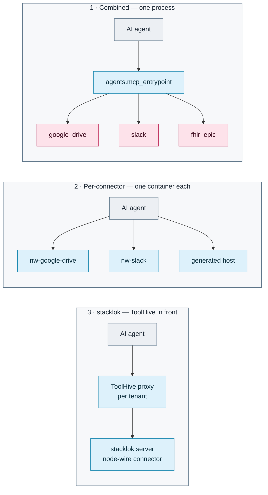

<!--
SPDX-FileCopyrightText: 2026 AOT Technologies

SPDX-License-Identifier: Apache-2.0
-->

# Model Context Protocol (MCP) in Node Wire

Node Wire integrates with the Model Context Protocol to allow AI agents (like Claude or custom LLM orchestrators) to discover and use connectors as tools. Every path below serves the same connectors through the same [`run()` pipeline](architecture.md#the-run-pipeline). Tool names are `<connector_id>_<action>` ([bindings](connector-bindings.md#mcp-binding)).

## Which MCP path?

| Path | What you get | Choose it when | Start here |
|---|---|---|---|
| **1. Combined server** | One process, `python -m agents.mcp_entrypoint`, exposing every connector enabled for `mcp` in `config/connectors.yaml` | Local development, one agent using several connectors, one tenant selection covering all of them | [Transport modes](#transport-modes) below |
| **2. Per-connector server** | One container per connector: the pre-built `docker/<name>` images (`nw-google-drive`, `nw-slack`, …) or a host generated by `nw gen-all` / `nw gen-mcp` | Modular deployments, one image per ToolHive server, OpenAPI-generated connectors | [Local wheels → images](local-packages-to-images.md) · [nw CLI](cli/nw-cli.md) |
| **3. stacklok server** (`nw gen-stacklok`) | A stacklok mcp-builder server with AI-curated tools, running on a node-wire connector, with one ToolHive proxy per tenant | You want a curated tool set, ToolHive-owned auth, and Kubernetes manifests | [stacklok MCP servers](stacklok-mcp-servers.md) |

Paths 1 and 2 share the MCP binding, so they have Node Wire auth, scope policy, [tool search](#tool-search-mode) and the [tenant tools](architecture/tenancy.md#mcp-tenant-and-config-tools). Path 3 hands auth to ToolHive and drops those binding-only features ([limits](stacklok-mcp-servers.md#limits)).



For **outbound OAuth**, when Node Wire is the *client* of a remote authorized MCP server, see [MCP client OAuth](mcp-client-oauth.md).

---

## Transport Modes

Switch between transports using the `NW_MCP_TRANSPORT` environment variable.

### 1. `stdio` (Default)

Communicates via standard I/O. Best for local development and subprocess-based clients.

```bash
# Bash (Linux/macOS)
NW_MCP_TRANSPORT=stdio uv run python -m agents.mcp_entrypoint
```

```powershell
# PowerShell (Windows)
$env:NW_MCP_TRANSPORT="stdio"; uv run python -m agents.mcp_entrypoint
```

Drop `uv run` to use an already-activated environment's `python` directly.

### 2. `streamable-http`

The MCP Streamable HTTP transport: a single HTTP endpoint that upgrades to an SSE stream when a
response is streamed. This is the successor to the deprecated standalone `sse` transport, not
the same thing.

```bash
# Bash (Linux/macOS)
NW_MCP_TRANSPORT=streamable-http NW_MCP_HOST=127.0.0.1 NW_MCP_PORT=8081 NW_MCP_PATH=/mcp \
  uv run python -m agents.mcp_entrypoint
```

```powershell
# PowerShell (Windows)
$env:NW_MCP_TRANSPORT="streamable-http"; $env:NW_MCP_HOST="127.0.0.1"
$env:NW_MCP_PORT="8081"; $env:NW_MCP_PATH="/mcp"
uv run python -m agents.mcp_entrypoint
```

### Streaming Features
- **Configurable Buffering (`NW_STREAM_BUFFER_MS`)**: When streaming, output can be buffered to reduce event spam. Set to the duration in milliseconds (e.g., `2000` for a 2-second batching window). Default is `0` (no buffering).
- **Completion Signals**: The core runtime emits structured "done" signals (`stream_completion_log`) via Python logging when streaming ends, allowing package consumers to easily detect when a stream finishes.

---

## Testing with MCP Inspector

The [MCP Inspector](https://github.com/modelcontextprotocol/inspector) is the best way to validate your MCP tools locally.

### Testing stdio
```bash
npx @modelcontextprotocol/inspector uv run python -m agents.mcp_entrypoint
```

### Testing streamable-http
1. Start the server (as shown above).
2. Run the inspector:
```bash
npx @modelcontextprotocol/inspector
```
3. In the UI, select **Streamable HTTP** and connect to `http://127.0.0.1:8081/mcp`.

---

## Tool search mode

For connectors with many tools (e.g. a large generated OpenAPI connector), listing every tool costs model context on every request. Set `NW_MCP_TOOL_MODE=search` (or `McpServer(tool_mode="search")`) and `tools/list` returns two tools instead:

- **`nw_search_tools`** `{query, limit?}` — BM25 keyword search over tool names, descriptions and argument names/descriptions. Returns up to `limit` (default 5, max 20) matching tools, each with its full `inputSchema`, so the model can call one straight away.
- **`nw_call_tool`** `{name, arguments}` — validates `arguments` against that tool's schema (same validator and messages as a direct `tools/call`) and runs it.

The listing stays around 1–2 KB whatever the connector size. Behaviour to know:

- Scope policy applies: a tool hidden from a caller is neither returned by search nor callable through `nw_call_tool` (it reads as unknown).
- Direct `tools/call` by tool name still works in this mode, for clients that already know the names.
- The multitenancy tools (`nw_select_tenant`, …) are listed as usual.
- Search is lexical: a request worded differently from the tool ("DM someone" vs `conversations_open`) can miss. Clients that show, approve or filter tools one by one see only `nw_call_tool`.

Default is `list` (unchanged). Modelled on FastMCP's search transform.

---

## Multi-tenancy

With `NW_MULTITENANCY_ENABLED=true`, paths 1 and 2 add `nw_list_tenants`, `nw_select_tenant`,
`nw_list_configs` and `nw_select_config`. The tenant is never a connector-tool argument. How the
tenant is resolved on each transport, and what the tools do: [Tenancy](architecture/tenancy.md).
Per-connector tool arguments (for example the FHIR aliases) are in the
[connector catalog](connector-reference.md#connector-catalog).

---

## Related Docs
- [Local wheels → images](local-packages-to-images.md): pre-built per-connector images and `docker-compose.mcp.yml`
- [nw-mcp-builder](cli/nw-mcp-builder.md): generated MCP hosts, run directly
- [ToolHive Agent Scenario](toolhive_agent_scenario.md)
